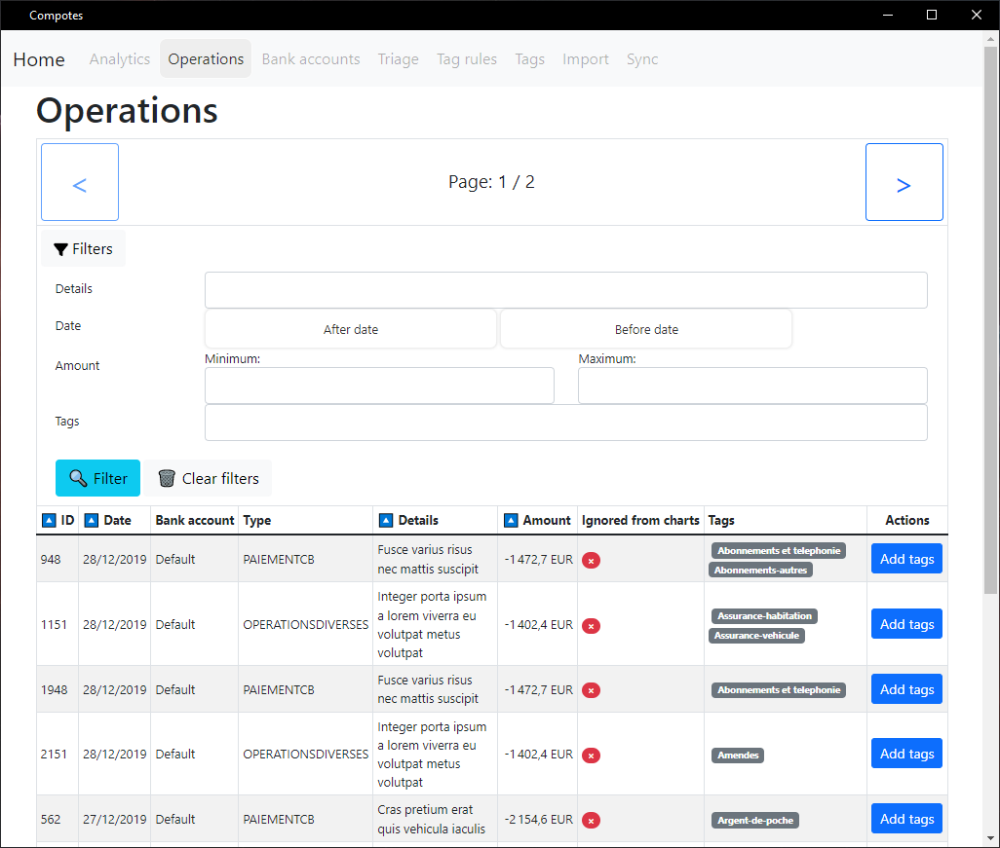

# 🍎 Compotes 🍏

A small application to visualise bank operations in graphs and plots.

# 🧮

> This is the second version of the main app that was previously built with PHP and Symfony.
>
> The new app is built in [Rust](https://www.rust-lang.org/) with [Tauri](https://tauri.studio/) for the backend, and uses [Typescript](https://www.typescriptlang.org/) and [Svelte](https://svelte.dev/) for the frontend part.



## Install

The project is not even in beta for now.

You can still find latest nightly builds on the [Actions](https://github.com/Orbitale/Compotes/actions) page, if you check out the latest successful action marked by a "☑️" mark (if there is one at least).

The latest builds can also be found on [nightly.link](https://nightly.link/Orbitale/Compotes/workflows/main.yaml/rewrite)

## Project setup

If you want to use the in-development project, you can compile it by doing what is explained in the following steps.

### Requirements

- [Rust](https://www.rust-lang.org/tools/install)
- [Node.js](https://nodejs.org/en/download/)
- [Yarn](https://yarnpkg.com/getting-started/install) (preferred by the Tauri team, so expect better compatibility)
- For Linux users:
  - Follow [this guide](https://tauri.studio/docs/getting-started/setting-up-linux#1-system-dependencies) to install the **system dependencies** that are mandatory.
- For Windows users:
  - [Webview2](https://developer.microsoft.com/en-us/microsoft-edge/webview2/#download-section)
- For MacOS users:
  - XCode
  - The GNU C Compiler, installable via `brew install gcc`

### Install

```
yarn install
```

> You do not need to install Rust dependencies, since running `cargo` commands like `cargo run` will automatically download and compile dependencies.

### Run the app in dev mode

```
yarn tauri dev
```

### Compile for production

```
yarn tauri build
```

> This command builds the app in the `src-tauri/target/release/` directory.

## Import a database from v1

- Run `make dump` in the v1 app
- Get the `var/dump_***.sql` file that was just generated
- Install `mysql2sqlite` via this script:
  ```bash
  wget https://raw.githubusercontent.com/dumblob/mysql2sqlite/master/mysql2sqlite
  ```
- Run it on the sql file you got and create your database:
  ```bash
  ./mysql2sqlite dump_***.sql | sqlite3 data.db3
  ```
- Pray it works 🙏

### Roadmap

Since the entire app is being rewritten, lots of stuff have to be re-implemented.

> The "☑️" mark means the feature is implemented, while the "⬜️" mark means the feature is waiting for implementation.

- Core features:
  - ☑️ Create the Tauri app
  - ☑️ Create the Svelte frontend with it
  - ☑️ List operations
    - ☑️ Allow sorting operations by some fields
    - ☑️ Allow filtering operations
    - ☑️ Allow saving current filter to be reused in graphs
    - ☑️ Allow filtering operations that have no tags
    - ☑️ Allow ignoring an operation in graphs calculations
  - ☑️ Tags CRUD
  - ☑️ Tag rules CRUD
  - ☑️ Bank accounts CRUD
    - ☑️ Edit bank account details
  - ☑️ Import operations from CSV file
  - ☑️ Add tags to operations directly from the list
  - ☑️ Sync operations for triage
  - ☑️ Sync operations tags with tag rules
  - ⬜️ Add the graphs that are at the core of this app 😅
    - ☑️ Allow using saved filters for graphs
    - ⬜️ Allow creating and saving custom graphs
- Additional features that might be cool:
  - ⬜️ Allow customizing graphs
  - ⬜️ Config panel to allow customizing database, export/import whole database
  - ⬜️ User account system for multi-user usage
  - ⬜️ Encrypt entire database with a password/passphrase for safety
  - ⬜️ Store filters to the database instead of `localStorage`
- Some things are quite buggy and the app needs improvements too:
  - ☑️ Check why we have to use `location.reload()` because svelte stores don't update the paginated tables => I actually used SvelteKit's `goto()` from `$app/navigation` and it works great 👌
  - ⬜️ Use a `select2` or similar for tags selection
  - ⬜️ Add the ability to create a Tag Rule based on an Operation in the operations list
